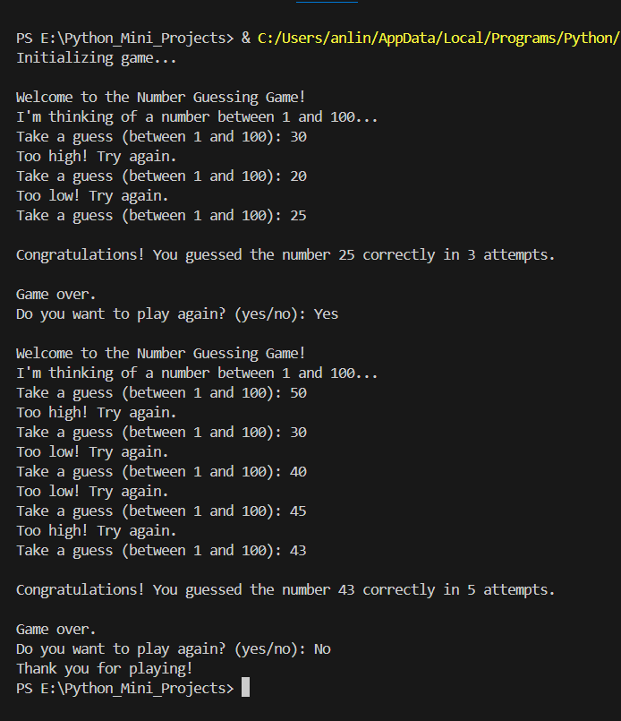

# Number Guessing Game
Welcome to the Number Guessing Game! This is a simple interactive Python game where the player tries to guess a random number generated by the computer. If you're looking for a fun way to pass the time and test your guessing skills, you've come to the right place!

## Features
* Randomly generated number between 1 and 100.
* Interactive user input for guessing the number.
* Feedback on whether the guess is too high or too low.
* Track of the number of attempts taken to guess correctly.
* Option to play multiple rounds.

## Getting Started
To run the game, make sure you have Python installed on your system. 

- Clone the repository to your local machine:
git clone https://github.com/your-username/number-guessing-game.git
- Navigate to the project directory:
cd number-guessing-game
- Run the game:
python number_guessing_game.py
- Follow the on-screen instructions to play the game.

## How to Play
* When the game starts, you'll be prompted to enter your guess for the random number.
* Enter a number between 1 and 100 and press Enter.
* You'll receive feedback on whether your guess is too high, too low, or correct.
* Keep guessing until you correctly guess the random number.
* After each round, you'll have the option to play again or exit the game.

## Here's an amazing depiction of what the game's output might look like:

## Acknowledgements
* This project is inspired by various number guessing games and Python tutorials available online.

### Have fun and happy guessing!

