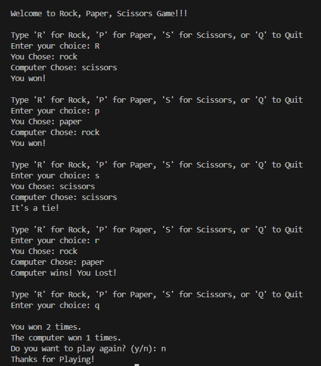

# Rock, Paper, Scissors Game
Welcome to the ultimate showdown of wits! This Python implementation of the classic game Rock, Paper, Scissors brings the thrill of competition right to your fingertips.
## How to Play
#### 1. Launch the Game: Run the Python script rock_paper_scissors.py.
#### 2. Make Your Move: You'll be prompted to choose your weapon:
- Type 'R' for Rock 🪨
- Type 'P' for Paper 📄
- Type 'S' for Scissors ✂️
- Type 'Q' to Quit ❌
#### 3. Face the Computer: Brace yourself as the computer selects its move randomly.
#### 4. Determine the Victor: The outcome of the round will be displayed, revealing whether you emerged victorious, faced defeat, or reached a thrilling tie.
#### 5. Play Again?: After each round, you'll have the option to keep the excitement going. Enter 'Y' to play another round or 'N' to gracefully bow out.
## Game Rules
- Rock crushes Scissors 🪨 > ✂️
- Scissors cuts Paper ✂️ > 📄
- Paper covers Rock 📄 > 🪨
## Files
rock_paper_scissors.py: The Python script containing the game's electrifying code.
## Requirements
Python 3.x: Prepare for the epic battle by ensuring you have Python installed on your device.
## Rock, Paper, Scissors Game Output

## *Happy Gaming and May the Best Strategist Prevail!* 🎮💥
